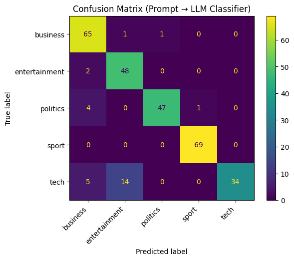

# Text Classification with LLMs: Prompting vs LoRA Fine-Tuning

## Overview

This project explores two approaches for text classification using Large Language Models (LLMs):

1. **Prompt-Based Classification (Zero-Shot)**
2. **Fine-Tuning with LoRA (Parameter-Efficient Training)**

The goal is to compare their performance, efficiency, and practicality on a real dataset.

---

## Project Structure
├── baseline/ # Prompt-based classification (FLAN-T5)
├── finetuning/ # LoRA fine-tuning (F2LLM-0.6B)
├── comparison/ # Evaluation and comparison between methods
└── artifacts/ # Saved models, metrics, predictions

---

## Methods

### 1. Prompt-Based Classification (Baseline)

- Uses `google/flan-t5-base`
- No training required
- Classification is done via carefully designed prompts
- Model generates a label as text

**Key idea:** Treat the model as a black-box reasoning system.

---

### 2. Fine-Tuning with LoRA

- Uses `codefuse-ai/F2LLM-0.6B`
- Adds a classification head + LoRA adapters
- Trains only a small subset of parameters (~0.7%)

**Key idea:** Adapt the model to the dataset for higher accuracy and consistency.

---

## Results

| Model | Method | Accuracy | Macro F1 |
|------|--------|---------|---------|
| FLAN-T5 | Prompting | XX | XX |
| F2LLM-0.6B | LoRA Fine-Tuning | XX | XX |

---

## Example Results

### Baseline (Prompting)

### Fine-Tuned Model (LoRA)

---

## Key Insights

- Fine-tuning significantly improves performance, especially on class boundaries
- Prompting is flexible but less consistent
- LoRA enables efficient training without updating the full model

**Trade-off:**

- Prompting → flexible, no training  
- Fine-tuning → higher accuracy, requires data and compute  

---

## How to Run

### 1. Clone the repository

  git clone https://github.com/n3ra96/baseline-subset-vs-fine-tuned-test.git
  cd your-repo

### 2. Install dependencies
  pip install -r requirements.txt
### 3. Run notebooks

  baseline/baseline.ipynb
  finetuning/finetune_lora.ipynb
  comparison/compare.ipynb

## Environment

  Tested on Google Colab
  
  GPU: Tesla T4
  Mixed precision: bf16

## Summary

  This project demonstrates the trade-off between:
  
  Prompting → fast, flexible, no training
  Fine-tuning → accurate, stable, data-driven
  
  Both approaches are valuable depending on the use case.
